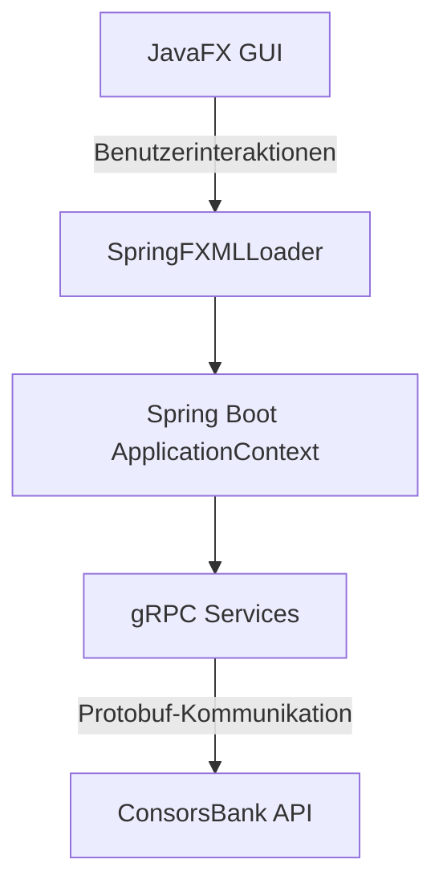
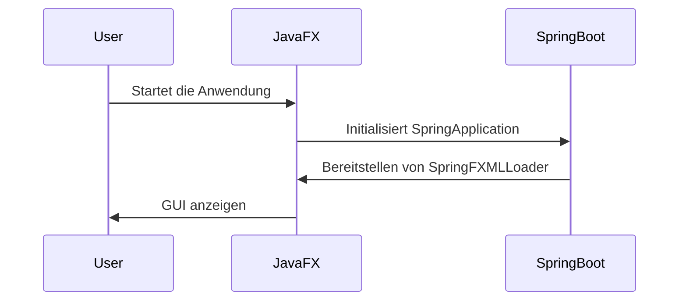
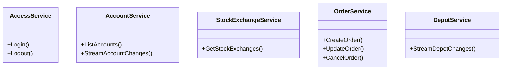

# ConsorsBank Dashboard - README

## Übersicht

Das **ConsorsBank Dashboard** ist eine JavaFX-Anwendung, die auf **Spring Boot** basiert. Es nutzt **gRPC**, um mit der ConsorsBank Trading API zu kommunizieren. Dieses Projekt dient als Grundlage für die Entwicklung von Applikationen, die Funktionen wie Handel, Kontoverwaltung und Börsendaten-Streaming bereitstellen.

### Wichtige Features:
- **JavaFX** für GUI.
- **Spring Boot** für Dependency Injection und Backend-Logik.
- **gRPC** für performante und bidirektionale Kommunikation.
- Integration von **protobuf** für automatische Generierung von gRPC-Klassen.

### Lizenz
Beachte die Lizenzbestimmungen (Apache 2.0 license), der in diesem Projekt enthaltenen Protobuf-Dateien und des von ConsorsBank gelieferten Frameworks.

---

## Projektstruktur

```plaintext
src/
├── main/
│   ├── java/
│   │   ├── consorsbank/
│   │   │   ├── controllers/  # JavaFX Controller
│   │   │   ├── services/     # Service-Schicht für gRPC-Kommunikation
│   │   │   └── util/         # SpringFXMLLoader für JavaFX
│   ├── resources/
│   │   ├── views/            # FXML-Dateien für JavaFX
│   │   └── application.yml   # Spring Boot Konfiguration
│   ├── proto/                # Protobuf-Dateien (.proto)
├── build.gradle              # Build-Skript mit gRPC- und Protobuf-Plugins
```

### Mermaid-Diagramm: Architekturübersicht



---

## Einrichtung

### Voraussetzungen

- **JDK 17+**
- **Gradle 8+**
- **Protobuf Compiler**: Version `3.24.0`
- Abhängigkeiten werden automatisch via Gradle verwaltet.

### Installation

1. **Projekt klonen**:
   ```bash
   git clone https://github.com/dein-repo/consorsbank-dashboard.git
   cd consorsbank-dashboard
   ```

2. **Abhängigkeiten installieren**:
   ```bash
   ./gradlew build
   ```

3. **Start der Anwendung**:
   ```bash
   ./gradlew run
   ```

---

## Besondere Konfigurationen

### JavaFX und Spring Boot Integration

Die Integration von **JavaFX** mit **Spring Boot** erfolgt über einen speziellen Loader (`SpringFXMLLoader`), der die FXML-Dateien lädt und die Controller durch den Spring ApplicationContext injiziert.

```java
Parent root = fxmlLoader.load("/views/main.fxml").load();
```

Spring Boot wird in der `Main`-Klasse initialisiert:

```java
@Override
public void init() {
    springContext = new SpringApplicationBuilder(ConsorsBankApplication.class).run();
}
```

### Mermaid-Diagramm: Ladeprozess von JavaFX und Spring Boot



---

## Generierung von gRPC-Klassen

Die Java-Klassen für gRPC werden aus den `.proto`-Dateien im Verzeichnis `src/main/proto/` generiert. Dazu wird das **Protobuf Plugin** von Gradle verwendet.

### Schritte zur Generierung

1. **Definiere die `.proto`-Dateien** in `src/main/proto/`.
   Beispiel:
   ```proto
   syntax = "proto3";
   option java_package = "com.consorsbank.module.tapi.grpc";
   message LoginRequest {
       string secret = 1;
   }
   ```

2. **Konfiguriere das Protobuf-Plugin in `build.gradle`**:
   ```groovy
   protobuf {
       protoc {
           artifact = 'com.google.protobuf:protoc:3.24.0'
       }
       plugins {
           grpc {
               artifact = 'io.grpc:protoc-gen-grpc-java:1.57.0'
           }
       }
       generateProtoTasks {
           all().each { task ->
               task.plugins {
                   grpc {}
               }
           }
       }
   }
   ```

3. **Generiere die Klassen**:
   ```bash
   ./gradlew generateProto
   ```

   Die generierten Klassen werden im Ordner `build/generated/source/proto/main/java/` abgelegt und automatisch im Projekt eingebunden.

### Offizielle Dokumentation

Mehr Informationen zur Protobuf-Integration findest du hier: [gRPC Java Basics](https://grpc.io/docs/languages/java/basics/).

---

## Funktionen laut ConsorsBank API

### Mögliche Implementierungen

Die ConsorsBank API bietet verschiedene Dienste, die mit diesem Projektgerüst implementiert werden können:

- **Access Service**:
    - Login und Logout.
    - Verwaltung von Zugangstokens.

- **Account Service**:
    - Liste von Handelskonten abrufen.
    - Änderungen an Kontoinformationen verfolgen.

- **Stock Exchange Service**:
    - Informationen zu Börsen abrufen.

- **Order Service**:
    - Aufträge erstellen, ändern, und stornieren.
    - Orderbuch-Daten streamen.

- **Depot Service**:
    - Depotdaten abrufen und verfolgen.

### Diagramm: API-Dienste



### Offizielle Dokumentation

Alle Dokumente zur ActiveTrader API der ConsorsBank kannst du hier herunterladen: [Trading-API (ActiveTrader)](https://www.consorsbank.de/content/dam/de-cb/editorial/Apps/TAPI/Dokumentation%20Java.zip). Dort ist neben den protobuf-Dateien (siehe proto) auch eine Anleitung (documentation) zur Verwendung der API (als PDF und auch im HTML-Format) enthalten. Zudem findest du dort ein Beispielprojekt. Die ebenfalls (unter src/main/java/com/consorsbank/module/tapi/grpc) mitgelieferten generierten Klassen sind hingegen nicht erforderlich, da sie druch das Gradle-Plugin automatisch generiert werden. Auch die (im Ordner lib) enthaltenen Abhängigkeiten sind veraltet und sollten durch aktuellere Versionen ersetzt werden, falls es nicht zu Fehlfunktionen führt.

---

## Fazit

Dieses Projekt bietet eine solide Grundlage für die Entwicklung von Anwendungen, die die ConsorsBank Trading API verwenden. Mit JavaFX als GUI-Framework, Spring Boot als Backend und gRPC für die Kommunikation kannst du leicht leistungsfähige und skalierbare Anwendungen erstellen.
